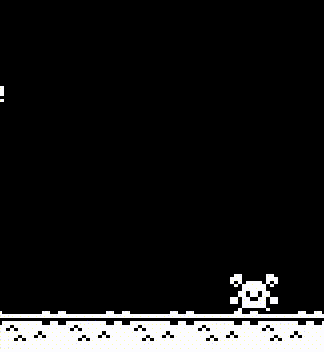

# 🎮 Eric Moura

**`Game Engineer`**

Desenvolvedor especializado em C++ com foco em jogos e sistemas de alta performance. Desenvolvi a **Ni Engine**, uma engine in-house construida com SFML e OpenGL, com arquitetura baseada em componentes e foco em código limpo e manutenibilidade. Ela já foi usada para a criação de um jogo completo. Quais as motivações para a criação de uma engine proprietária? no meu caso, esse processo está me ajudando a entender as diversas camadas que formam um jogo. 

  
  

Todos os meus jogos podem ser encontrados no meu <a href="linkdoportfo">portfólio profissional</a> 

  
  

---
### 🧰 Linguagens e ferramentas
      

#

### 👾 Últimos Jogos

<table>
  <tr>
    <td align="center" style="padding: 12px;">
      <strong><a href="https://github.com/ericericmoura/easy-game">Easy Game</a></strong>      
       
      2D · Platformer
       
            
    </td>
  </tr>
</table>

#

</img>

  
<h3>📖 Minha jornada na programação</h3>

  Sempre me interessei por tecnologia, principalmente robótica, devido a influência de filmes e jogos. Meu primeiro contato real com a programação foi no Tinkercad, que permitia a criação de protótipos de arduino e eletrônica. Foi através do Arduino que tive meu primeiro contato com C++. Os projetos eram simples na época, mas ainda muito emocionantes. Depois que comprei meu primeiro arduino segui fazendo diversos projetos, e realizando melhorias em projetos existentes. Meu maior e mais marcante projeto com o Arduino foi um carrinho de controle remoto com bluetooth, que também tinha um modo de desvio de obstaculo automático, usando um sensor ultrassonico. Depois de alguns anos trabalhando com Arduino, resolvi tentar algo novo, baixei o GameMaker (na época se chamava GameMaker Studio 2) e tentei criar um jogo. Era um jogo top-down estilo bullet hell, o jogo ficou legal, mas não segui em frente com o projeto. Depois fui passando de engine em engine, experimentando várias opções: unity, godot, unreal. No fim, acabei me apegando bastante ao Godot, e passei um bom tempo estudando e aprendendo a usar essa engine. Também desenvolvi alguns jogos nela. Hoje, tenho foco em estudar desenvolvimento de jogos usando ferramentas de baixo nível. Quero entender tudo o que diz respeito ao desenvolvimento de um jogo, pois sei que isso vai me ajudar a crescer como profissional. Futuramente também desejo me especializar em Unreal.

#

### 📊 GitHub Stats:

 

 

